## Intelligent Data Processing Lab., The Chosun University, Rep. of Korea

The Intelligent Data Processing Lab. (IDP Lab) in Chosun University study on biometrics, digital health, security, explainable AI (XAI) for advanced mobility. 
Our vision is to analyze cutting-edge technologies and provide innovative solutions, contributing to solving various industrial and societal challenges.
Our goal is to design robust and reliable systems by leveraging generative and multimodal learning-based data processing technologies.

<!--
**IDPLab-chosun/IDPLab-chosun** is a ✨ _special_ ✨ repository because its `README.md` (this file) appears on your GitHub profile.

Here are some ideas to get you started:

- 🔭 I’m currently working on ...
- 🌱 I’m currently learning ...
- 👯 I’m looking to collaborate on ...
- 🤔 I’m looking for help with ...
- 💬 Ask me about ...
- 📫 How to reach me: ...
- 😄 Pronouns: ...
- ⚡ Fun fact: ...
-->
